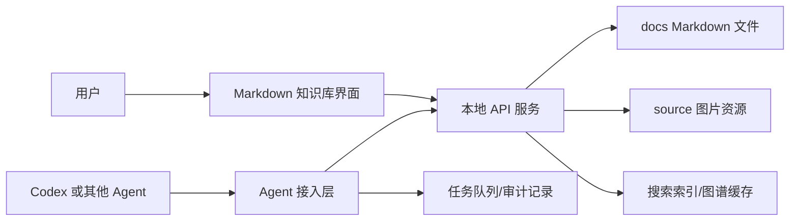

# Codex 与其他 Agent 接入设计方案

## 一、目标

为 Markdown 文档知识库预留 Agent 能力，让 Codex 或其他本地/远程智能体能够参与文档整理、搜索、总结、改写、知识图谱分析和自动化维护。

接入 Agent 的核心目标不是替代人工编辑，而是成为文档知识库的辅助工作层：

- 帮助快速理解现有文档
- 自动生成摘要和标签
- 检查文档之间的关联
- 根据截图和文档内容生成说明
- 辅助重构目录结构
- 给出缺陷检测和优化建议
- 支持未来自动化任务流

## 二、设计原则

### 1. 本地文件优先

文档仍然以 `docs` 目录下的 Markdown 文件为核心，图片仍然存放在 `source` 目录。Agent 只能围绕这些真实文件工作，不把内容锁进私有数据库。

### 2. 人工确认优先

Agent 可以提出修改建议，也可以生成草稿，但涉及删除、批量移动、覆盖保存、重命名等操作时，应由用户确认。

### 3. 接口边界清晰

Agent 不直接操作前端 DOM，而是通过后端 API 访问文档、搜索、图谱和文件管理能力。这样可以复用现有功能，也便于做权限控制和审计。

### 4. 可替换 Agent

系统不绑定某一个 Agent。Codex、OpenAI API、本地模型、企业内部 Agent 都可以通过统一接口接入。

## 三、推荐架构



## 四、Agent 接入层能力

建议新增一组 `/api/agent/*` 接口，不直接暴露底层文件系统。

### 1. 文档读取

```text
GET /api/agent/docs
GET /api/agent/doc?path=xxx.md
```

用途：

- 让 Agent 获取文档列表
- 读取指定文档内容
- 结合搜索结果做总结

### 2. 文档建议

```text
POST /api/agent/suggest
```

输入：

```json
{
  "path": "README.md",
  "task": "优化结构并补充启动说明"
}
```

输出建议：

```json
{
  "summary": "建议补充安装步骤和截图说明",
  "patch": "...",
  "risk": "低"
}
```

建议先返回方案，不自动写入。

### 3. 安全写入

```text
POST /api/agent/apply
```

要求：

- 必须携带用户确认标记
- 写入前生成备份
- 返回修改摘要
- 记录操作日志

### 4. 文档摘要与标签

```text
POST /api/agent/analyze
```

可生成：

- 文档摘要
- 关键词
- 标签
- 推荐分类
- 相关文档
- 缺失内容建议

### 5. 图谱增强

```text
POST /api/agent/graph-insight
```

用途：

- 分析孤立文档
- 发现重复主题
- 推荐合并或拆分
- 给出知识树优化方案

## 五、Codex 接入思路

Codex 更适合做项目级改造和代码维护，因此建议给 Codex 提供清晰的任务入口：

### 1. 文档维护任务

例如：

- “检查所有 Markdown 是否存在乱码”
- “找出没有标题的文档”
- “生成项目使用教程”
- “把部署文档整理成步骤化格式”
- “检查图片引用是否失效”

### 2. 功能开发任务

例如：

- “新增文档版本历史”
- “优化全文搜索索引”
- “改进知识图谱布局”
- “增加图片资源管理页面”
- “把打包流程升级成正式安装器”

### 3. 测试与审计任务

例如：

- “测试所有 API”
- “检查拖拽文件是否安全”
- “检测删除文件是否有误删风险”
- “统计项目大小和依赖”

## 六、其他 Agent 接入思路

其他 Agent 可以通过 HTTP API 或本地命令接入。

适合接入的能力包括：

- 本地大模型做文档摘要
- OCR Agent 识别截图内容
- 搜索 Agent 做跨文档问答
- 自动化 Agent 定期检查坏链
- 企业 Agent 同步规范模板
- 语音 Agent 把会议纪要转成 Markdown

## 七、安全设计

### 1. 只允许访问项目目录

Agent 接口必须限制在：

```text
docs
source
public
```

不能允许任意路径读写。

### 2. 高风险操作必须确认

以下操作必须经过用户确认：

- 删除文件
- 批量移动
- 批量改名
- 覆盖保存
- 清理图片
- 应用 Agent 生成的补丁

### 3. 保留操作日志

建议新增：

```text
.agent-logs
```

记录：

- 操作时间
- Agent 名称
- 操作类型
- 影响文件
- 用户是否确认

### 4. 自动备份

写入前建议备份到：

```text
.history
```

这样即使 Agent 修改不理想，也可以恢复。

## 八、推荐开发路线

### 第一阶段：只读智能分析

- 文档摘要
- 自动关键词
- 坏链检测
- 图片引用检测
- 孤立文档检测

### 第二阶段：建议式编辑

- 生成修改建议
- 生成 Markdown 草稿
- 推荐目录分类
- 推荐知识图谱关联

### 第三阶段：可确认写入

- 用户确认后应用修改
- 写入前自动备份
- 生成操作日志
- 支持撤销

### 第四阶段：自动化工作流

- 定期扫描文档质量
- 自动生成周报
- 自动整理截图说明
- 自动生成发布说明
- 与 Codex 开发任务联动

## 九、总结

Agent 接入的重点不是让系统变复杂，而是让现有 Markdown 知识库具备“可理解、可建议、可辅助维护”的能力。

推荐先做只读分析，再做建议式编辑，最后再开放可确认写入。这样既能发挥 Codex 和其他 Agent 的能力，又能保证本地文档的安全和可控。

